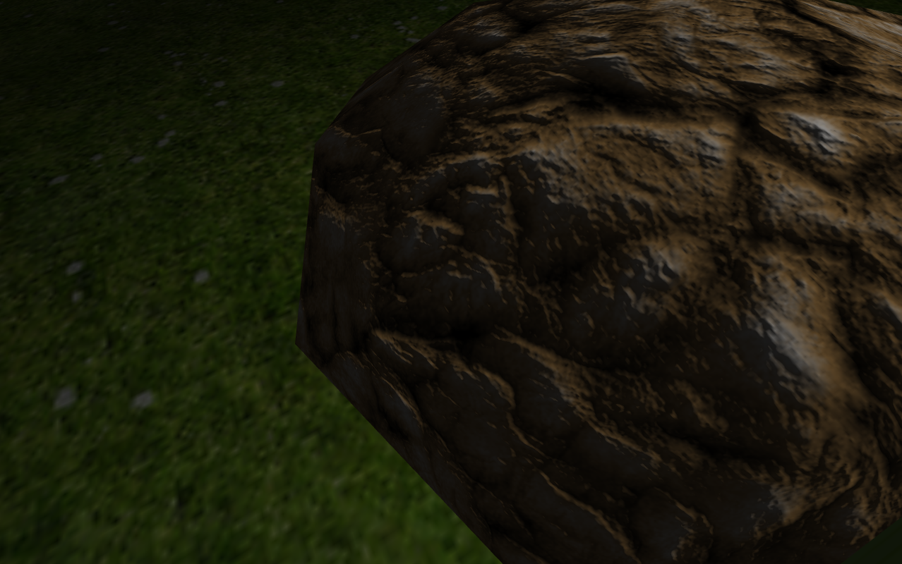
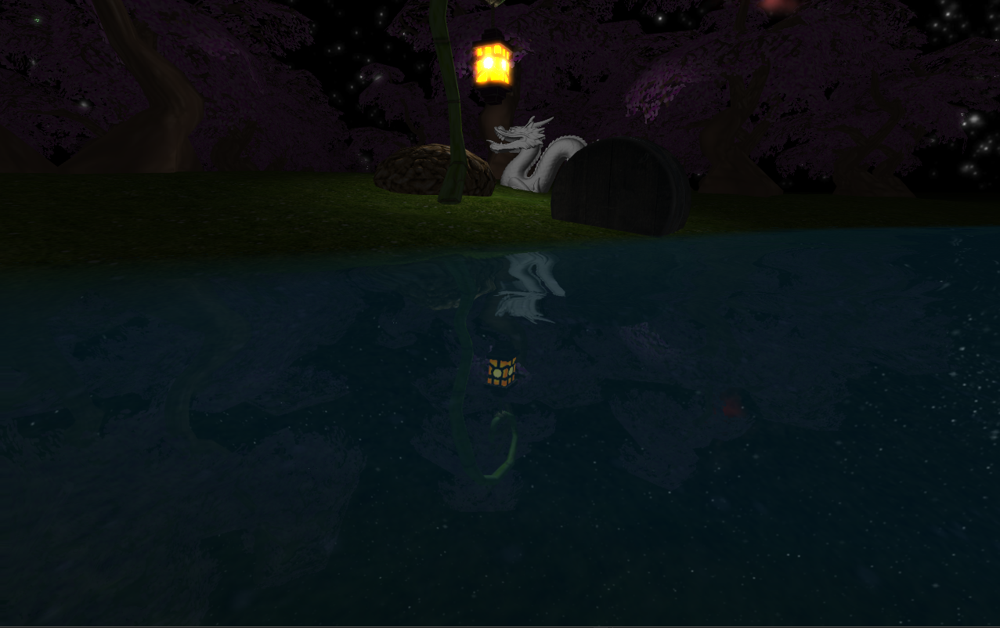

# 3D Model Engine
## About aplication
It's a simple 3D model application written in C++ using OpenGL API with implemented:
- 3D model .obj extension files loader including those with normal mapping,
- water renderer,
- entity system,
- simple terrain system with height maps,
- basic light objects implementation,
- post-processing effects (gaussian blur, contrast, blume effect),
- skybox,
- player entity, which gives ability to move around the map

I am sure that the list will expand in the future with shadow rendering, GUIs, cel shading, text implementation and some maps other than this one with lake. Here are nice images of what will you encounter if you run the application.

<div style="text-align:center">

</div>
<div style="text-align:center">

</div>

## How to run:
Easiest way to run this application is to go in Release folder and run Application.exe file. To run the program, you need to have graphics card which supports OpenGL 3.2 version. If the application somehow manage to deny working after few tries, you can run it in Visual Studio with projects files that I included in this repository. Just remember to run x86 Release or Debug configuration.

## How to expand and modify the project

If you wish to add some of your models or you want to modify current map (ie. add some more entities and lights), you can modify the code in Application.cpp. To add new model, you need to move your .obj and .png model files in resources ("res") models and textures directory respectively and add this chunk of code after other models initialization (around line 50):
```
    auto your_model = OBJLoader::load_obj("yourModel", loader);
    auto your_texture = std::make_shared<ModelTexture>(loader->load_texture("yourTexture"));
    auto your_textured_model = std::make_shared<TexturedModel>(your_model, your_texture);
``` 
First line is simple, you create RawModel object which holds ID and information about your model. Next line will create ModelTexture object to carry the weight of the model texture. In the end, you need to combine this to things in the TexturedModel object. Then you can create new Entity object with it (after around line 103 when vector of entities is created):
```
    auto your_entity = std::make_shared<Entity>(your_textured_model, glm::vec3(270, 0, 234), 0, 0, 0, 1);
    entities.push_back(your_entity);
```
First parameter is your textured model, second is position in the world map and last four are object rotations and scale. If you want to test your normal mapped model with specular map, you could add these lines in the model creation part:
```
    auto your_model = NormalMappingOBJLoader::load_normal_mapped_obj("yourModel", loader);
    auto your_texture = std::make_shared<ModelTexture>(loader->load_texture("yourTexture"));
    your_texture->set_normal_map(loader->load_texture("modelNormal"));
    your_texture->set_specular_map(loader->load_texture("modelS"));
    auto your_textured_model = std::make_shared<TexturedModel>(your_model, your_texture);
```
Feel free to ask me about anything if you want to modify current map :)
    
## Quick overview of files and folders structure

### res folder

Resources folder contains three other folders:
- models (with .obj files),
- shaders (with .glsl shader files),
- textures (with .png textures).

### src folder

Source folder contains application code:
- entities (entities implementation and rendering them),
- models (loading .obj files, textures and storing information about them),
- renderEngine (managing scene rendering),
- renderEngine/postProcessing (post-processing effects),
- shaders (shader program implementation),
- skybox (skybox rendering),
- terrain (terrain implementation and rendering),
- textures (texture data containers),
- toolbox (contains display, input and some math functions),
- vendor (contains glm and stb_image),
- water (water rendering code).

## Contributors
* [Mateusz Gancarz](https://github.com/magancarz)